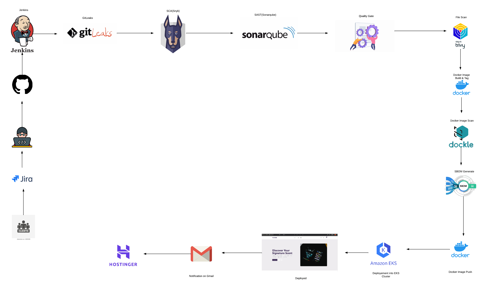
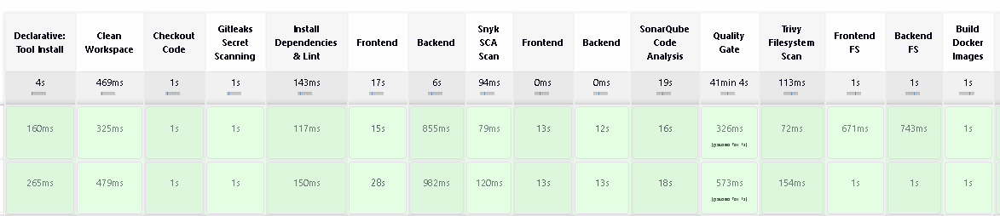
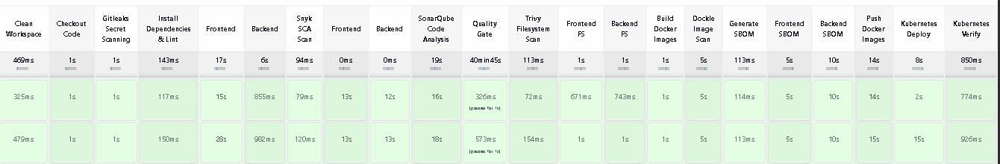
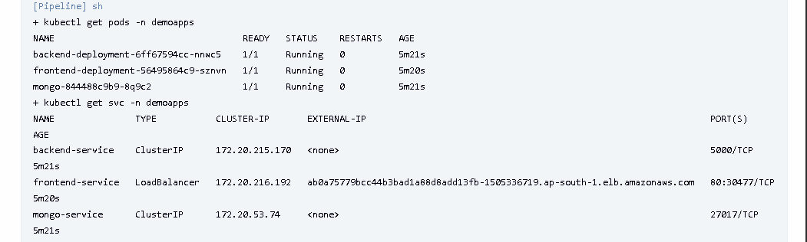
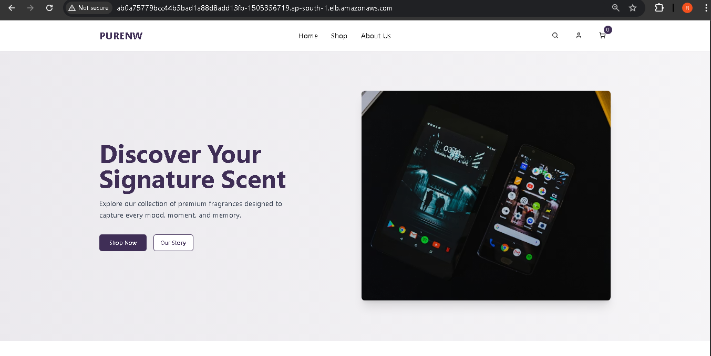
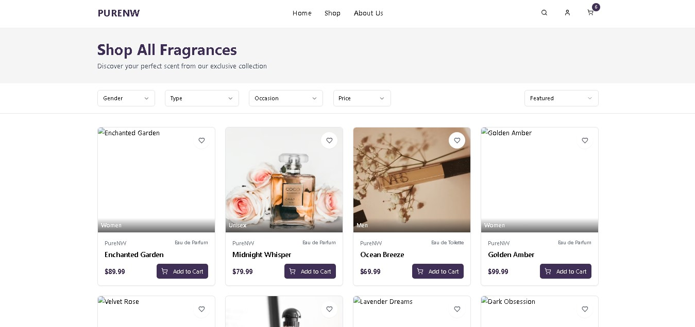
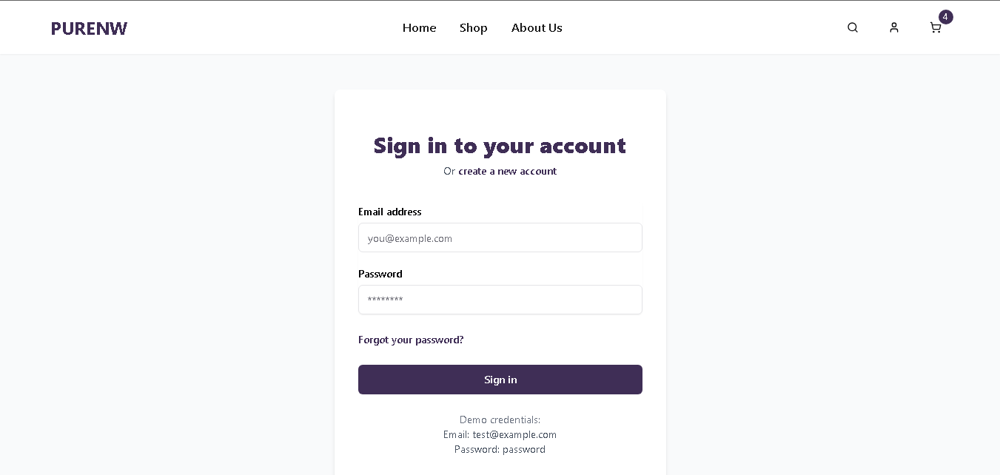
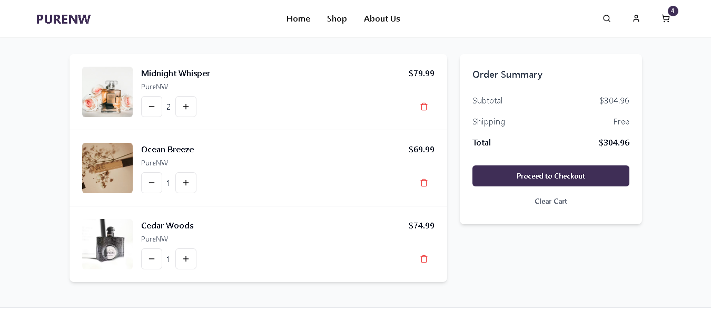

# 🛡️ DevSecOps-Security-Pipeline

A **production-grade DevSecOps pipeline** for a MERN Stack Online Perfume Store, demonstrating end-to-end security integration from code to deployment.

[]()
[]()
[]()

---

## 📋 Overview

This project showcases a **complete DevSecOps pipeline** with multiple security scanning tools integrated at every stage—from secret detection to container vulnerability scanning—before deploying to AWS EKS.

**Live Demo:** Online Perfume E-commerce Store built with MERN Stack

---

## 🏗️ Project Deployment Flow

<p align="center">
    
</p>

---

## 🔧 Tech Stack

### **Application Layer**

```
Frontend:
├── React.js          # UI Framework
├── Node.js       # JavaScript Runtime
└── npm               # Package Manager

Backend:
├── Node.js      # Server Runtime
├── Express.js        # Web Framework
└── JavaScript        # Programming Language

Database:
└── MongoDB           # NoSQL Database
```

### **DevOps & Infrastructure**

```
CI/CD:
├── Jenkins           # Pipeline Orchestration
├── Git/GitHub        # Version Control
└── kubectl           # Kubernetes CLI

Containerization:
├── Docker            # Container Platform
└── Docker Hub        # Container Registry (17rj)

Orchestration:
└── AWS EKS           # Managed Kubernetes (ap-south-1)
```

### **Security Tools (DevSecOps)**

```
Secret Scanning:
└── Gitleaks          # Detect hardcoded secrets

Dependency Scanning (SCA):
└── Snyk              # Software Composition Analysis

Code Quality (SAST):
└── SonarQube         # Static Application Security Testing

Filesystem Security:
└── Trivy             # Vulnerability Scanner

Container Security:
└── Dockle            # Docker Image Linter

Supply Chain Security:
└── Syft              # SBOM (Software Bill of Materials) Generator
```

---

## 🚀 Pipeline Stages

| Stage                  | Tool       | Purpose                             | Status |
| ---------------------- | ---------- | ----------------------------------- | ------ |
| **1. Secret Scan**     | Gitleaks   | Detect API keys, passwords          | ✅     |
| **2. Dependency Scan** | Snyk       | Check npm packages vulnerabilities  | ✅     |
| **3. Code Analysis**   | SonarQube  | SAST + Quality Gate                 | ✅     |
| **4. Filesystem Scan** | Trivy      | Scan source code vulnerabilities    | ✅     |
| **5. Container Scan**  | Dockle     | Docker best practices check         | ✅     |
| **6. SBOM Generation** | Syft       | Generate Software Bill of Materials | ✅     |
| **7. Deploy**          | Kubernetes | Deploy to AWS EKS                   | ✅     |

---

## 📊 Pipeline Results

### **Jenkins Pipeline View**

<p align="center">
    
</p>

### **Stage-wise Execution**

<p align="center">
    
</p>

### **Kubernetes Deployment**

<p align="center">
    
</p>

---

## 🖼️ Application Screenshots

<table>
  <tr>
    <td></td>
    <td></td>
  </tr>
  <tr>
    <td></td>
    <td></td>
  </tr>
</table>

---

## 🛠️ Prerequisites

Before running this pipeline, ensure you have:

- Jenkins with required plugins
- Docker & Docker Hub account
- AWS EKS cluster configured
- SonarQube server running
- Snyk account & API token
- Security tools installed:
- Gitleaks
- Trivy
- Dockle
- Syft

---

## 📁 Project Structure

```
DevSecOps-Security-Pipeline/
├── frontend/              # React.js application
│   ├── src/
│   ├── Dockerfile
│   └── package.json
├── backend/               # Node.js/Express API
│   ├── routes/
│   ├── Dockerfile
│   └── package.json
├── K8s/                   # Kubernetes manifests
│   ├── frontend-deployment-service.yml
│   ├── backend-deployment-service.yml
│   └── db-ds.yml
├── Jenkinsfile            # Pipeline configuration
├── docker-compose.yaml    # Docker Compose File
└── snapshot/              # Screenshots & diagrams
```

---

## 🔐 Security Features

- ✅ **Secret Detection** - Prevents hardcoded credentials
- ✅ **Dependency Scanning** - Identifies vulnerable packages
- ✅ **Code Quality Gates** - Blocks low-quality code
- ✅ **Container Scanning** - Detects image vulnerabilities
- ✅ **SBOM Generation** - Tracks software components
- ✅ **Policy Enforcement** - Quality gates block deployment

---

## 🤝 Contributing

Contributions are welcome! Please follow these steps:

1. Fork the repository
2. Create feature branch (`git checkout -b feature/AmazingFeature`)
3. Commit changes (`git commit -m 'Add AmazingFeature'`)
4. Push to branch (`git push origin feature/AmazingFeature`)
5. Open Pull Request

---

## 📝 License

This project is licensed under the MIT License.

---

## 👨‍💻 Author

**Rahul Joshi**  
📧 Email: 17rahuljoshi@gmail.com  
🔗 GitHub: [@17J](https://github.com/17J)

---

## ⭐ Show Your Support

Give a ⭐ if this project helped you learn DevSecOps!

---

**Built with ❤️ for DevSecOps Community**
